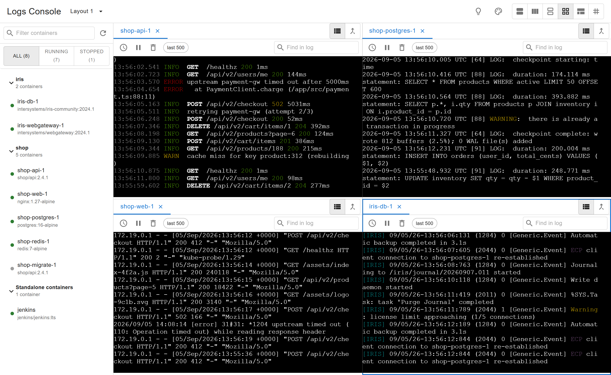
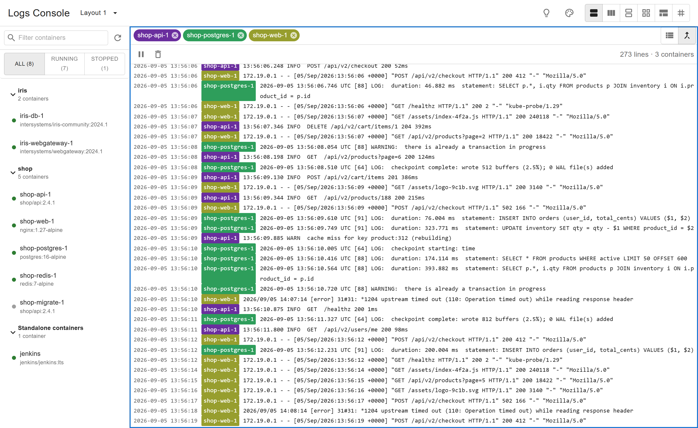
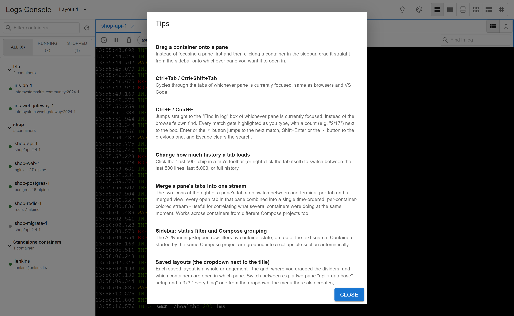

# Logs Console — Docker Desktop Extension

A multi-tab, split-screen viewer for `docker logs`, built as a Docker Desktop
extension. It borrows its tab-per-container idea from
[maltus/docker-logs-viewer](https://github.com/maltus/docker-logs-viewer) and
its container-list-first browsing from Docker's own **Logs Explorer**
extension, but differs from both in two load-bearing ways:

- **Split screen** — open several containers' logs at once, side by side, in
  a resizable 1 / 2 / 2×2 / 3×2 / 3×3 pane layout, instead of only ever
  tab-switching between them.
- **Native log rendering** — logs are rendered with [xterm.js](https://xtermjs.org/),
  the same terminal-emulator technology behind real terminals, using its
  default theme and raw `docker logs` byte output. There is no custom
  table, JSON pretty-printing, or recoloring layered on top — it looks like
  running `docker logs -f` in a terminal. (Docker's own Logs Explorer, by
  contrast, renders everything into a data-grid table and doesn't interpret
  ANSI colors at all.)



## Features

- **Split-screen panes** — 1 / 2 (left-right or top-bottom) / 2×2 / 3×2 /
  3×3, resizable by dragging the dividers. The last two are aimed at large
  monitors; on a normal laptop screen they're cramped, but that's yours to
  decide, not the extension's.
- **Drag a container from the sidebar onto any pane** to open it there
  directly, instead of focusing the pane first and then clicking the
  container.
- **Merged view** — combine every tab currently open in a pane into a single
  chronologically-interleaved, per-container-colored stream, for correlating
  what several containers were doing at the same moment. Works across
  containers from different Compose projects, not just within one.

  

- **Compose-aware sidebar** — containers auto-group by
  `com.docker.compose.project`, filterable by name/image and by
  All/Running/Stopped, updated live off `docker events` (no polling).
- **Per-tab history control** — click the "last 500" chip in a tab's toolbar
  (or right-click the tab) to switch between the last 500 lines, last 5,000,
  or full history.
- **Ctrl+Tab / Ctrl+Shift+Tab** cycles through the tabs of whichever pane is
  focused, same convention as browsers and VS Code.
- **Terminal color theme** (palette icon in the top bar) — Classic (xterm
  default), Soft Dark, or Solarized Dark, switchable live without
  disrupting an active log stream. Display-only, same as picking a color
  scheme in any real terminal — it never touches the raw log bytes.
- A **Tips** dialog (💡 in the top bar) documents all of the above in-app.

  

## Requirements

- Docker Desktop with the `docker extension` CLI (already installed with
  recent Docker Desktop releases).
- Node.js 18+ for building the UI.

## Build & install

```sh
make install     # builds the image and installs it into Docker Desktop
```

Then open Docker Desktop and select **Logs Console** from the left sidebar.

## Development (hot reload)

```sh
cd ui && npm install && npm run dev   # Vite dev server on :3000
make dev-ui                            # point the installed extension at it
make dev-debug                         # open devtools for the extension UI
```

Run `make reset-dev` to go back to the built assets.

## Changelog

See [CHANGELOG.md](CHANGELOG.md) for what changed in each tagged release.

## Architecture

See [CLAUDE.md](CLAUDE.md) for the full breakdown (module-by-module, plus
the non-obvious gotchas hit while building this - Allotment's orientation-
flip bug, xterm.js swallowing Ctrl+Tab, `file://` asset paths, and so on).
Short version: everything lives under `ui/src/`, there's no extension
backend/VM, and the UI talks to Docker only through
`ddClient.docker.cli.exec` plus one small per-OS host binary (see
`host/`) that cleans up orphaned `docker logs -f` processes left over from
an unclean shutdown.
