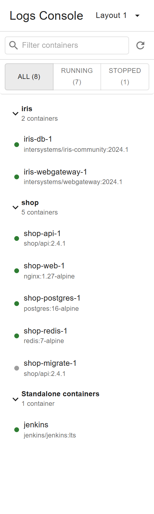
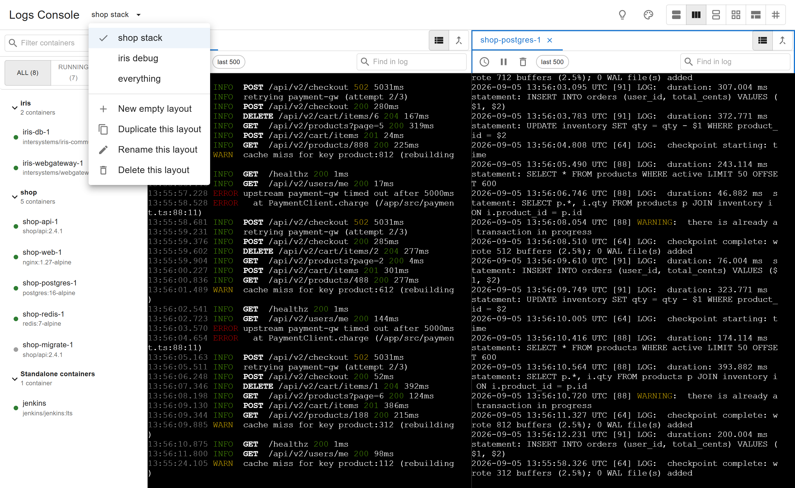
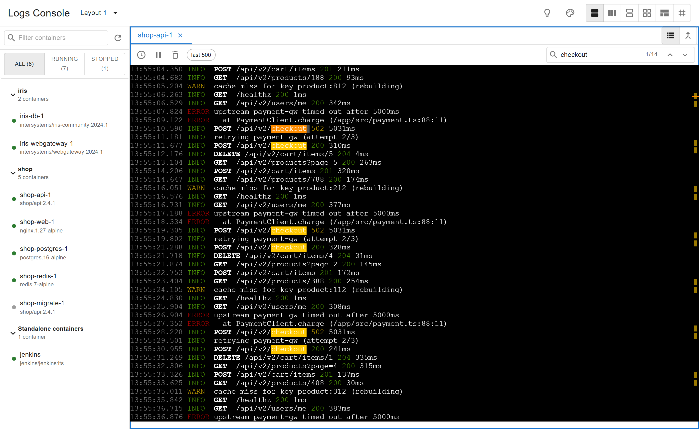
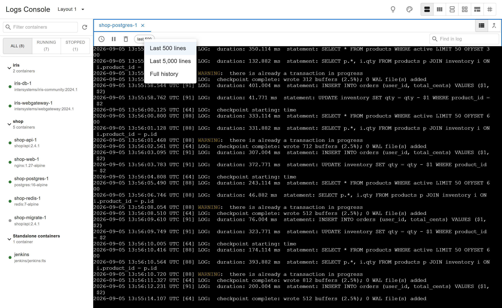
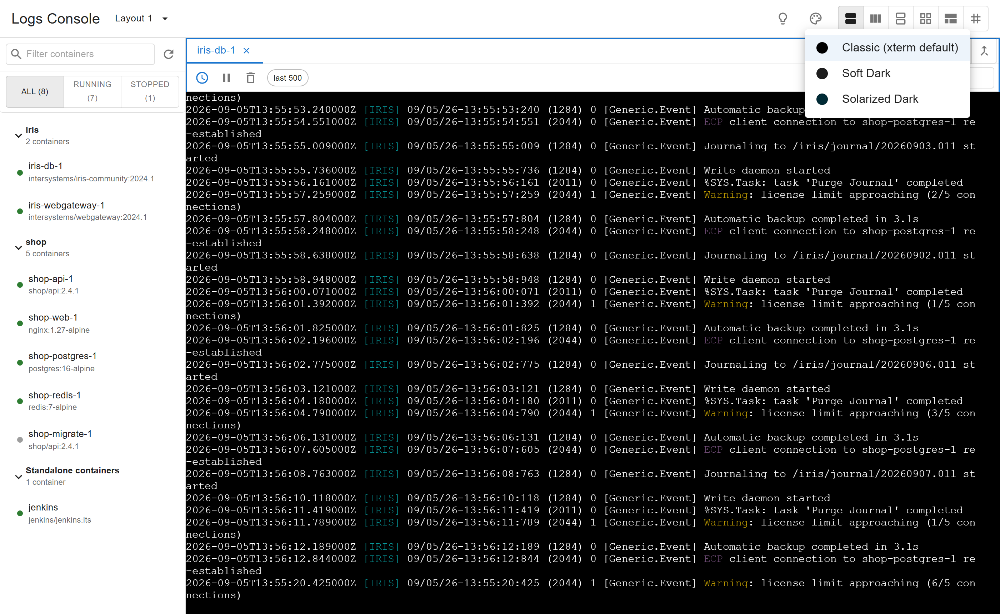

# Logs Console — Docker Desktop Extension

A multi-tab, split-screen viewer for `docker logs`, built as a Docker Desktop
extension. It borrows its tab-per-container idea from
[maltus/docker-logs-viewer](https://github.com/maltus/docker-logs-viewer) and
its container-list-first browsing from Docker's own **Logs Explorer**
extension, but differs from both in two load-bearing ways:

- **Split screen** — open several containers' logs at once, side by side, in
  a resizable 1 / 2 / 2×2 / 3×2 / 3×3 pane layout, instead of only ever
  tab-switching between them.
- **Native log rendering** — logs are rendered with [xterm.js](https://xtermjs.org/),
  the same terminal-emulator technology behind real terminals, using its
  default theme and raw `docker logs` byte output. There is no custom
  table, JSON pretty-printing, or recoloring layered on top — it looks like
  running `docker logs -f` in a terminal. (Docker's own Logs Explorer, by
  contrast, renders everything into a data-grid table and doesn't interpret
  ANSI colors at all.)


## Features

### Split-screen panes

1 / 2 (left-right or top-bottom) / 2×2 / 3×2 / 3×3, resizable by dragging
the dividers. The last two are aimed at large monitors; on a normal laptop
screen they're cramped, but that's yours to decide, not the extension's.

Divider positions are remembered per grid shape, and stored as ratios — a
split saved on a wide monitor comes back correct on a narrow one. That's
the screenshot at the top of this page.

### Compose-aware sidebar

Containers auto-group by `com.docker.compose.project`, filterable by
name/image and by All/Running/Stopped. The list updates live off
`docker events` rather than polling `docker ps` on a timer, so it reacts
within milliseconds of a container starting or stopping.



**Drag a container from the sidebar onto any pane** to open it there
directly, instead of focusing the pane first and then clicking the
container.

### Merged view

Combine every tab currently open in a pane into a single
chronologically-interleaved, per-container-colored stream, for correlating
what several containers were doing at the same moment. Works across
containers from different Compose projects, not just within one.


### Saved workspaces

The dropdown next to the title holds whole arrangements — the grid, where
the dividers sit, and which containers are open in which pane. A two-pane
"api + database" setup and a 3×3 "everything" setup can both exist and be
switched between instead of rebuilt by hand. Create empty, duplicate,
rename, delete. There is deliberately no Save button: edits land in the
selected workspace as they happen.

Everything survives leaving the extension tab and coming back, which
Docker Desktop otherwise treats as a full teardown of the UI.



### Search within a pane

**Ctrl+F** opens "Find in log". Every match is highlighted, not just the
current one, with a `current/total` counter and prev/next buttons; matches
outside the viewport show up as marks on the scrollbar. Escape clears it.



### Per-tab history control

Click the "last 500" chip in a tab's toolbar (or right-click the tab) to
switch between the last 500 lines, last 5,000, or full history. Timestamps
toggle per tab too.



### Terminal color theme

Palette icon in the top bar — Classic (xterm default), Soft Dark, or
Solarized Dark, switchable live without disrupting an active log stream.
Display-only, same as picking a color scheme in any real terminal — it
never touches the raw log bytes.



### Keyboard shortcuts, and the Tips dialog

**Ctrl+Tab / Ctrl+Shift+Tab** cycles through the tabs of whichever pane is
focused, same convention as browsers and VS Code. The **Tips** dialog
(💡 in the top bar) documents all of the above in-app, which is the only
discovery path for things like drag-to-pane that have no visible affordance.


## Install

```sh
docker extension install cjy513203427/docker-logs-console:latest
```

Then open Docker Desktop and select **Logs Console** from the left sidebar.

This is not in the Extensions Marketplace — Docker has
[paused new Marketplace submissions](https://github.com/docker/extensions-submissions)
while it reviews Marketplace security — so it has to be installed by image
reference. That's the same command the Marketplace's Install button runs
underneath; the only thing you miss is browsing to it in Docker Desktop's
Extensions UI.

## Requirements

- Docker Desktop with the `docker extension` CLI (already installed with
  recent Docker Desktop releases).
- Node.js 18+ only if you want to build the UI yourself.

## Build & install from source

```sh
make install     # builds the image and installs it into Docker Desktop
```

## Development (hot reload)

```sh
cd ui && npm install && npm run dev   # Vite dev server on :3000
make dev-ui                            # point the installed extension at it
make dev-debug                         # open devtools for the extension UI
```

Run `make reset-dev` to go back to the built assets.

## Changelog

See [CHANGELOG.md](CHANGELOG.md) for what changed in each tagged release.

## Architecture

See [CLAUDE.md](CLAUDE.md) for the full breakdown (module-by-module, plus
the non-obvious gotchas hit while building this - Allotment's orientation-
flip bug, xterm.js swallowing Ctrl+Tab, `file://` asset paths, and so on).
Short version: everything lives under `ui/src/`, there's no extension
backend/VM, and the UI talks to Docker only through
`ddClient.docker.cli.exec` plus one small per-OS host binary (see
`host/`) that cleans up orphaned `docker logs -f` processes left over from
an unclean shutdown.
